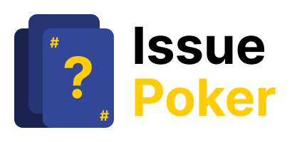

<!-- General project links -->

[open-issues]: https://github.com/Friedinger/IssuePoker/issues

[new-issue]: https://github.com/Friedinger/IssuePoker/issues/new/choose

[milestones]: https://github.com/Friedinger/IssuePoker/milestones

[documentation]: https://friedinger.github.io/IssuePoker/

[contribution-documentation]: .github/CODE_OF_CONDUCT.md

[itm-opensource]: https://opensource.muenchen.de/

[license]: LICENSE

[code-of-conduct]: .github/CODE_OF_CONDUCT.md

<!-- Project specific links -->

[spring-documentation]: https://spring.io/

[vuejs-documentation]:  https://vuejs.org/

<!-- Shields.io links -->

[documentation-shield]: https://img.shields.io/badge/documentation-blue?style=for-the-badge

[new-issue-shield]: https://img.shields.io/badge/new%20issue-blue?style=for-the-badge

[made-with-love-shield]: https://img.shields.io/badge/made%20with%20%E2%9D%A4%20by-it%40M-yellow?style=for-the-badge

[license-shield]: https://img.shields.io/github/license/Friedinger/IssuePoker?style=for-the-badge

<picture>
  <source media="(prefers-color-scheme: dark)" srcset="docs/public/IssuePoker_Logo_Dark.svg">
  <source media="(prefers-color-scheme: light)" srcset="docs/public/IssuePoker_Logo_Light.svg">
  
</picture>

# IssuePoker

[![Documentation][documentation-shield]][documentation]
[![New issue][new-issue-shield]][new-issue]
[![Made with love by it@M][made-with-love-shield]][itm-opensource]
[![GitHub license][license-shield]][license]

This project is a web application for planning and estimating software development issues.

The project is based on [Spring][spring-documentation] for the backend and [Vue.js][vuejs-documentation] for the frontend.

## Roadmap

See the [open issues][open-issues] for a full list of proposed features (and known issues).
We often also plan our issues in [milestones][milestones].

## Contributing

Contributions are what make the open source community such an amazing place to learn, inspire, and create. Any contributions you make are
**greatly appreciated**.

To learn more about how you can contribute, please read our [Code of Conduct][code-of-conduct].

## License

Distributed under the MIT License. See [LICENSE][license] file for more information.

## Contact

it@M - opensource@muenchen.de
