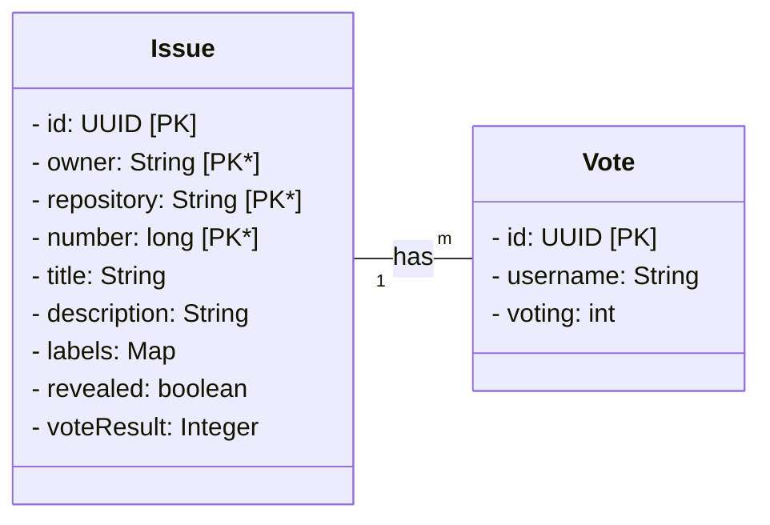

# Data model

IssuePoker consists of the entities `Issue` and `Vote`. The following diagram shows their relationship and attributes:

```mermaid
classDiagram
    direction LR
    class Issue {
        - id: UUID [PK]
        - owner: String [PK*]
        - repository: String [PK*]
        - number: long [PK*]
        - title: String
        - description: String
        - labels: Map<String, String>
        - revealed: boolean
        - voteResult: Integer
    }
    class Vote {
        - id: UUID [PK]
        - username: String
        - voting: int
    }
    Issue "1" -- "m" Vote : has
```
